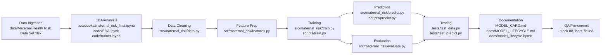

# Model Lifecycle

This document describes the model lifecycle with Mermaid diagram and references to actual repository files.

## Lifecycle Steps

1. **Data Ingestion** - Read raw data from `data/Maternal Health Risk Data Set.xlsx`
2. **EDA & Analysis** - Explore data in `notebooks/maternal_risk_final.ipynb` and `code/EDA.ipynb`, `code/trainer.ipynb`
3. **Data Cleaning** - Remove duplicates and filter (HeartRate >= 40) via `src/maternal_risk/data.py`
4. **Feature Preparation** - Prepare features/target in `src/maternal_risk/features.py`
5. **Training** - Train SVM (C=100, gamma=0.03, class_weight=balanced, random_state=42) in `src/maternal_risk/train.py`, exposed via `scripts/train.py`
6. **Evaluation** - Compute metrics in `src/maternal_risk/evaluate.py`
7. **Prediction** - Inference via `src/maternal_risk/predict.py` and `scripts/predict.py` (returns exactly 3 classes)
8. **Testing** - Validate with `tests/test_data.py` and `tests/test_predict.py`
9. **Documentation** - Maintain `MODEL_CARD.md` (Google format), this lifecycle doc, and BPMN in `docs/model_lifecycle.bpmn`
10. **Quality Assurance** - Run pre-commit hooks (black 88, isort, flake8)

## Mermaid Diagram

